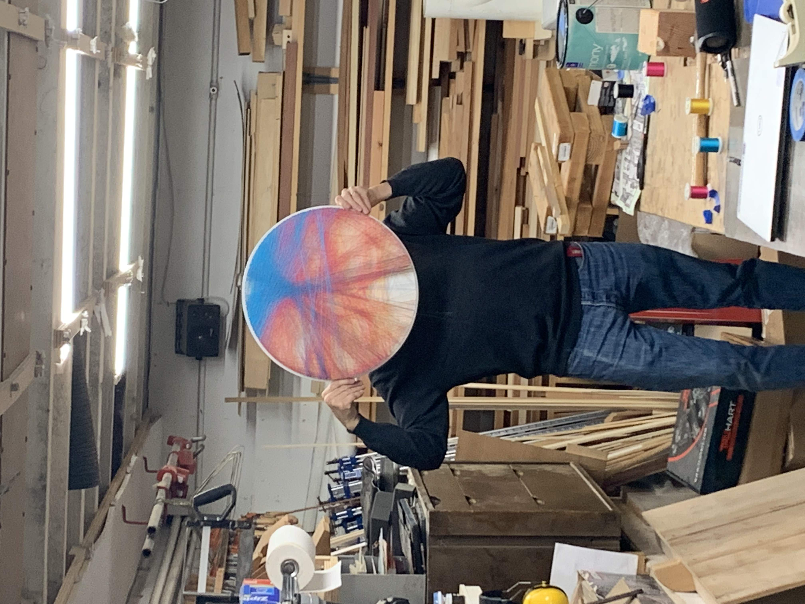

# Thread-Art

For best results, scale the image down to ~350x350px, replace unimportant parts with the color white, and increase the contrast.
You will have to play around with parameters a lot to get a good result.

An image after processing:

A finished product:
If you have trouble seeing the image, try squinting your eyes. You should see two faces.

All parameters have default values.
usage: seamster.py [-h] [-i iterations] [-n nails] [-s subtract] [-o order] [-d diameter] image_name

positional arguments:
  image_name     the filename of the image, including the extension

optional arguments:
  -h, --help     show this help message and exit
  -i iterations  number of iterations
  -n nails       number of nails on the board
  -s subtract    percent of color which is subtracted per nail
  -o order       order of colors
  -d diameter    diameter of final product (gives string estimate)

